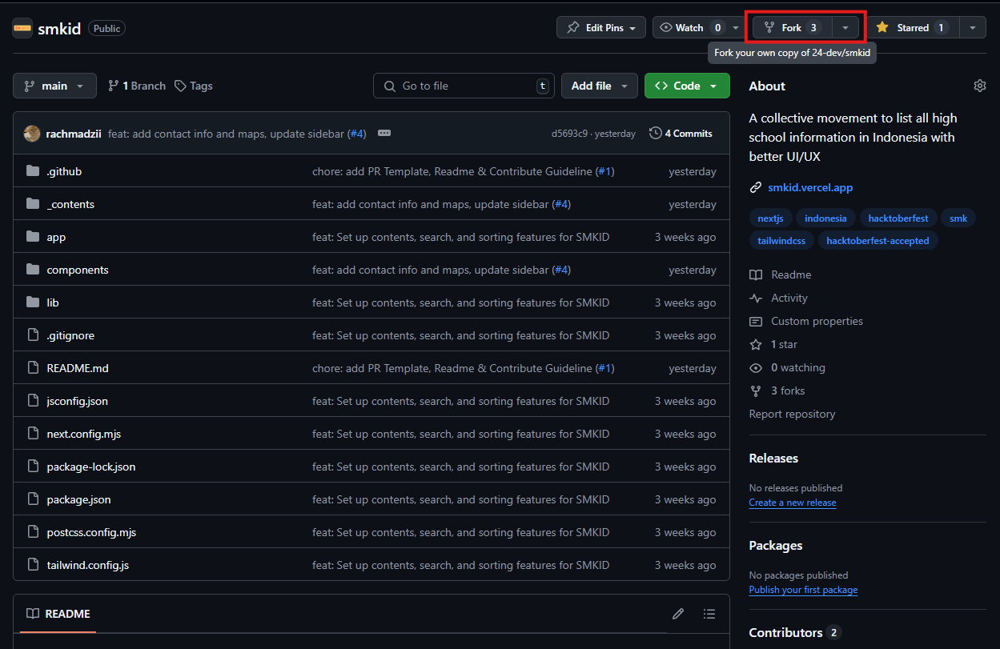
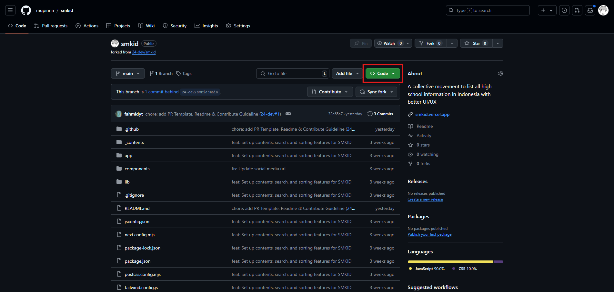
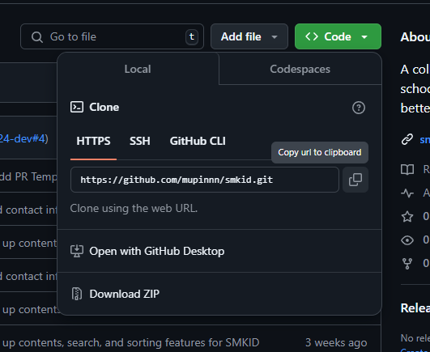
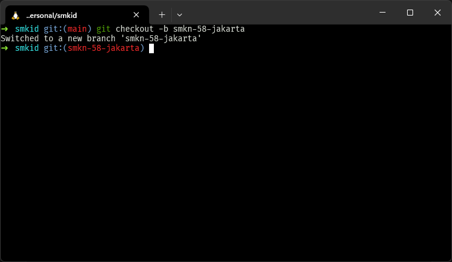
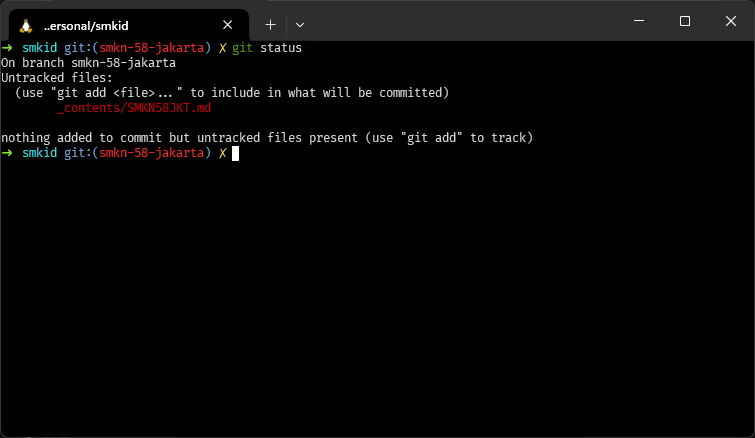
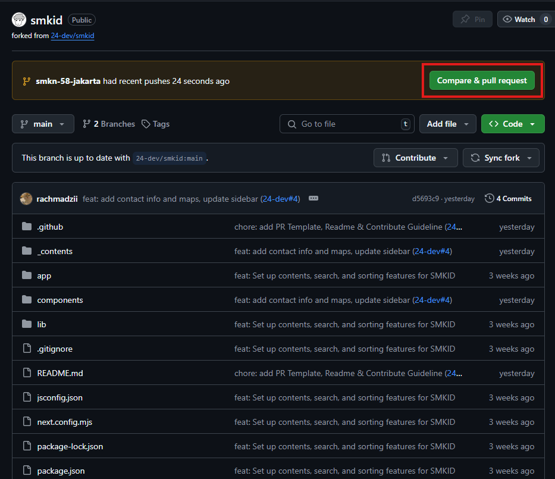
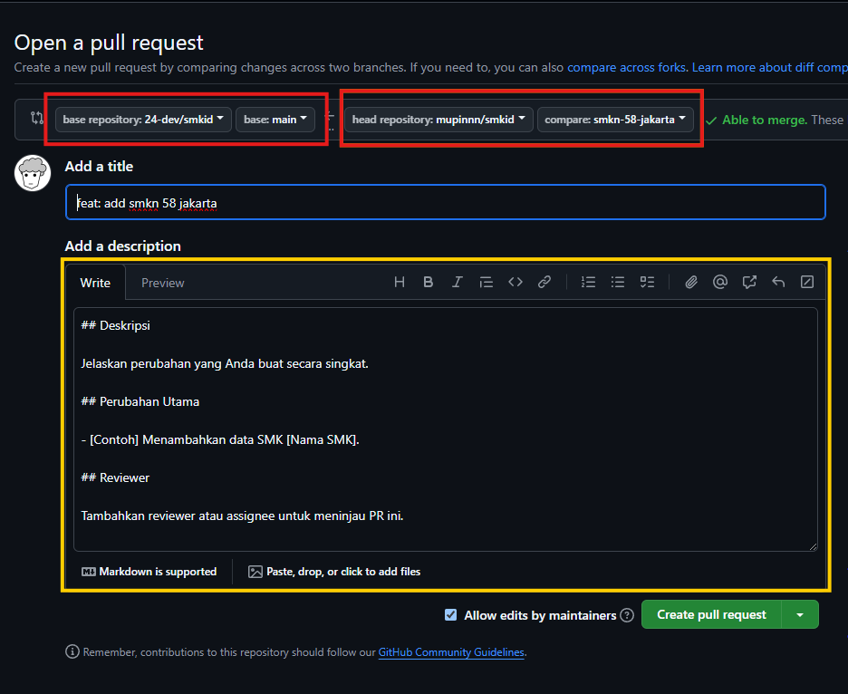
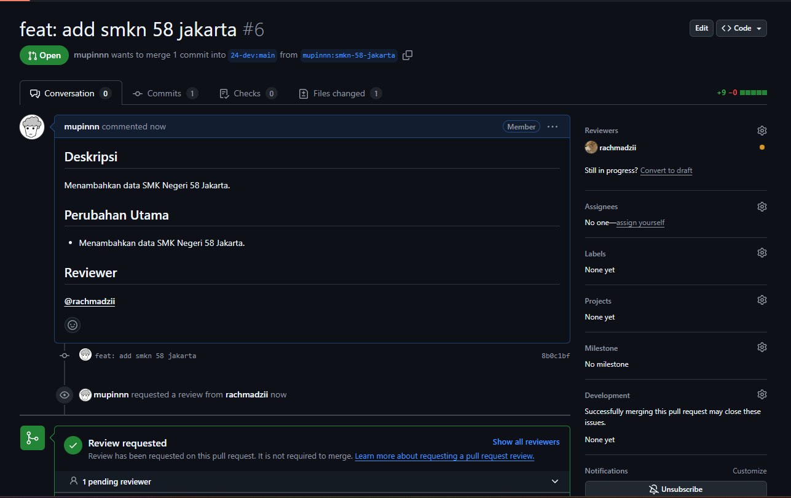

import { Steps } from "@astrojs/starlight/components";

Perangkat lunak atau _software_ sudah menjadi bagian dari hidup kita sejak dimulainya revolusi digital
sekitar tahun 1940/1960-an. Hampir setiap sendi kehidupan kita disokong oleh teknologi—yang salah
satunya adalah _software_.

Sebagai _developer_, menulis kode adalah makanan sehari-hari kita. Namun, pernahkah kalian bertanya-tanya
mengapa 95% _software_ yang kalian gunakan untuk bekerja itu bisa gratis? _Text editor, library, framework,_
hingga sistem operasi pun ada yang bisa kalian gunakan secara gratis-tis-tis-tis. Hal ini berdasar pada
istilah dan gerakan FOSS (_Free and Open Source Software_) yang dimulai pada tahun 1980-an oleh Richard Stallman.
Gerakan tersebut bertujuan agar setiap orang memiliki kebebasan terhadap sebuah perangkat lunak, seperti:

- Kebebasan untuk menjalankan program sesuai kehendak kalian, untuk tujuan apa pun.
- Kebebasan untuk mempelajari bagaimana program itu bekerja dan merubahnya sesuai kehendak kalian.
  Syarat yang harus terpenuhi adalah: akses ke kode sumber.
- Kebebasan untuk mendistribusikan ulang sehingga kalian bisa menolong sesama.
- Kebebasan untuk mendistribusikan ulang salinan program yang sudah kalian modifikasi.
  Jika melakukan praktik ini, maka orang banyak juga bisa mendapat manfaat dari perubahan yang kalian buat.
  Syarat yang harus terpenuhi adalah: akses ke kode sumber.

_Open Source_ juga bukan istilah yang asing bagi kita sebagai _developer_. Banyak _library_ atau paket-paket
yang dibuat oleh orang lain dan didistribusikan melalui platform seperti GitHub, sehingga orang di seluruh
dunia bisa menggunakannya, melihat kode sumbernya, dan bisa ikut berkontribusi untuk perbaikan atau peningkatan fitur.

## GitHub dan Hacktoberfest

GitHub, selain menjadi platform kerja kolaborasi _developer_, bisa juga menjadi media sosial bagi _developer_
untuk memamerkan proyek-proyeknya. Manfaat yang didapat selain orang lain bisa melihat kode sumber kita dan
menggunakannya, membuat proyek _open source_ di GitHub juga bisa memperbesar peluang mendapat pekerjaan; karena
rekruter bisa dengan mudah menilai pekerjaan kita dari apa yang kita kerjakan secara terbuka.

Menyambung soal _open source_ atau proyek sumber terbuka, ada sebuah _event_ tahunan menarik bernama Hacktoberfest.
Hacktoberfest merupakan _event_ sebulan penuh pada bulan Oktober untuk mendorong kontributor proyek _open source_
dan _developer_ seluruh dunia untuk memberi kembali kepada komunitas _open source_. _Yes_, memberi kembali.
Karena pada hakikatnya, setiap perangkat lunak yang kita pakai secara gratis ini untuk bekerja atau belajar,
ada jerih payah orang lain yang membuatnya gratis—untuk itu, agar komunitas ini tetap hidup, kita bisa mulai
dengan cara belajar bagaimana cara berkontribusi ke proyek _open source_ di GitHub.

## Memulai Kontribusi Pertama

24 DEV memiliki sebuah proyek _open source_ bernama SMKID yang bertujuan untuk menguratori informasi seluruh
SMK yang ada di Indonesia agar mudah dicari. Kode sumber proyek ini bisa diakses melalui laman https://github.com/24-dev/smkid
dan akses situsnya melalui laman https://smkid.vercel.app/.

Kita akan coba mempelajari bagaimana cara berkontribusi sekecil apa pun pada proyek _open source_.
Pada kesempatan ini, kita akan menambahkan data SMK yang belum tersedia di SMKID.

### Persiapan

- Akun [GitHub](https://github.com/)
- Git yang sudah terpasang pada perangkat kalian. Jika belum, bisa ikut panduan berikut: [Instalasi Git](/pusat-belajar/tutorials/git/instalasi-git/)
- _Text editor_ favorit kalian seperti [Visual Studio Code](https://code.visualstudio.com/download)
- Kemauan
- Pastikan data SMK yang akan kalian tambahkan belum ada di https://github.com/mupinnn/smkid/tree/main/_contents atau
  https://smkid.vercel.app/. Kalian bisa melakukan pencarian di situs tersebut untuk memastikan ketersediaan datanya.

### Langkah-langkah Membuat Kontribusi

<Steps>

1. Akses repositori SMKID pada https://github.com/24-dev/smkid
2. _Fork_ repositori tersebut sehingga kalian memiliki salinan repositori tersebut di profil GitHub kalian.
   

3. Pada halaman repositori yang sudah kalian fork di profil kalian, lakukan clone pada repositori tersebut
   ke perangkat kalian dengan menjalankan perintah berikut di terminal kalian:

   ```sh
   git clone https://github.com/username-kalian/smkid.git
   ```

   

   Langkah untuk mendapatkan URL untuk _clone_ bisa mengikuti gambar di bawah.

   

4. Buka folder hasil clone tadi, lalu buat branch baru sesuai dengan konten yang akan kalian tambahkan.
   Pada contoh ini, penulis akan menambahkan data SMKN 58 Jakarta.

   ```sh
   git checkout -b sekolah-yang-ingin-ditambah
   ```

   

5. Tambahkan konten sesuai dengan format yang ada. Silakan cek berkas berikut https://github.com/24-dev/smkid/blob/main/_contents/SMKN2SBY.md?plain=1

   

6. Lalu, _push_ perubahan tersebut ke _remote_ repositori hasil _fork_ tadi.

   ```sh
   git push
   ```

7. Lakukan _commit_ pada perubahan tersebut dengan perintah:

   ```sh
   git add .
   git commit -m "feat: add smkn 58 jakarta"
   ```

8. Buka halaman repositori fork SMKID kalian. Akan ada banner dengan tombol **“Compare & Pull Request”**, silakan klik tombol tersebut.
   

9. Perhatikan kotak merah dan kuning pada gambar di bawah.

   - Kotak merah
     - Pastikan _base repository_ mengarah ke `24-dev/smkid` dengan _base_-nya `main`
     - Pastikan _head repository_ mengarah ke `username-kalian/smkid` dengan _compare_-nya nama
       _branch_ yang sudah kalian buat dan _push_ tadi.
   - Kotak kuning
     - Isi judul sesuai konteks perubahan
     - Isi sesuai dengan template tersebut
     - Jika tidak tahu atau tidak ada, bisa diisi dengan \_"No information provided"

   

10. Jika sudah, klik **"Create pull request"** dan selesai!
    

11. Kalian hanya perlu menunggu _reviewer_ menyetujui perubahan kalian dan melakukan _merge_.
    Biasanya jika tidak sesuai standar, kalian akan diminta untuk memperbaikinya dan _feedback loop_ terjadi di sana.
12. **_Good luck!_**

</Steps>

Pada umumnya kalian juga bisa melihat isu apa saja yang ada pada sebuah proyek pada tab
“Issues” di GitHub. Jika kalian menyanggupi, kalian bisa langsung mengerjakannya atau
memberi tahu _maintainer_ di isu tersebut dengan cara membuat komentar yang menyatakan
bahwa kalian akan menyelesaikan isu tersebut.

Bicara soal isu, selain data SMK, SMKID juga ada beberapa isu terbuka nih untuk kalian coba.
Silakan akses di https://github.com/24-dev/smkid/issues dan mari terbang bersama!

Terima kasih!
