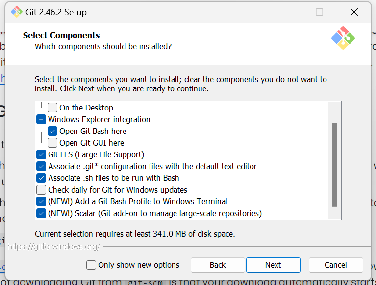
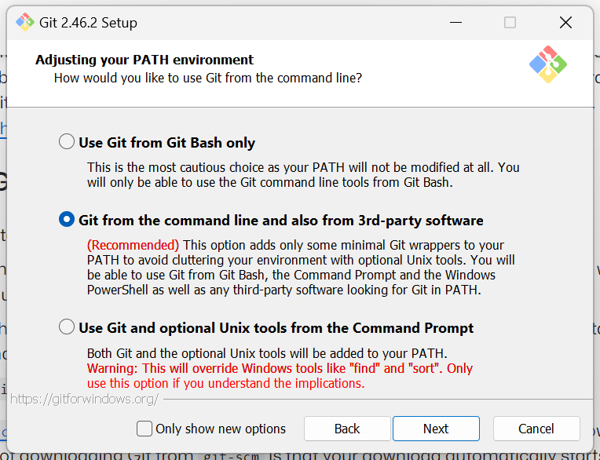

import { Steps } from "@astrojs/starlight/components";

Sebelum menggunakan Git, kita harus memastikan bahwa Git sudah tersedia di perangkat kita.
Git dapat dipasang pada sistem operasi _mainstream_ seperti Windows, macOS, dan Linux. Menariknya,
Git kadang kala sudah tersedia secara bawaan pada macOS dan Linux.

## Memeriksa ketersedian Git

Untuk memeriksa apakah Git sudah terpasang, silakan buka aplikasi _terminal_.

- Pada macOS, cari dan buka aplikasi yang bernama **"Terminal"**.
- Pada Windows, cari dan buka aplikasi yang bernama **"Command Prompt"** atau **"Git Bash"**.
- Pada Linux, kalian seharusnya sudah tahu harus apa :) Bercanda, pada umumnya di Linux pun nama
  aplikasinya sama; yaitu **"Terminal"**.

Setelah itu, silakan ketik `git version` lalu tekan "Enter". Perintah tersebut akan menunjukkan versi
Git yang sudah terpasang atau peringatan bahwa perintah `git` tidak ditemukan yang berarti kemungkinan
besar Git belum terpasang.

## Instalasi Git pada Windows

<Steps>

1. Buka laman [Git for Windows Installer](https://gitforwindows.org/) lalu unduh versi terkininya.
2. Buka hasil unduhan, lalu ikuti instruksi instalasinya hingga selesai.

   - Jika kalian baru belajar Git, gunakan opsi pemasangan standar tanpa mengubah apa pun sudah cukup.
     Hanya perlu klik "Next"/"Selanjutnya" hingga selesai.

     
     

3. Jika sudah selesai, buka **Command Prompt** atau **Git Bash**.
4. Ketik `git version` dan tekan "Enter" untuk memastikan Git sudah terpasang.

</Steps>

## Instalasi Git pada macOS

Umumnya Git sudah terpasang pada kebanyakan macOS. Cukup pastikan dengan menjalankan perintah `git version`
pada aplikasi Terminal. Jika Git belum terpasang, kalian bisa mengikut instruksi di bawah untuk memasang
Git pada macOS.

### Menggunakan _Installer_

Cara ini tidak begitu direkomendasikan karena versi Git yang digunakan pada rilisan terakhir adalah versi **2.33.0**
yang dirilis sekitar 3 tahun yang lalu, pada 30 Agustus 2021. Namun, hal ini tidak menjadi masalah karena Git
menjaga kompatibilitas dengan versi sebelumnya dengan sangat baik.

1. Unduh versi terakhir dari [macOS Git Installer](https://sourceforge.net/projects/git-osx-installer/files).
2. Buka hasil unduhan, lalu ikuti instruksi instalasinya hingga selesai.
3. Buka **Terminal** lalu jalankan perintah `git version` untuk memastikan Git sudah terpasang.

### Menggunakan Homebrew

Homebrew adalah _package manager_ populer untuk macOS. Jika Homebrew sudah terpasang pada perangkat kalian,
silakan ikuti instruksi di bawah untuk memasang Git melalui Homebrew:

1. Buka **Terminal** lalu jalankan perintah `brew install git`.
2. Jika perintah sudah sukses dijalankan dan pemasangan selesai, jalankan perintah `git version` untuk memastikan Git sudah terpasang.

## Instalasi Git pada Linux

Biasanya, Git sudah terpasang pada distro Linux mana pun. Namun jika belum tersedia, kalian bisa
memasangnya melalui _package manager_ yang tersedia untuk masing-masing distro.

### Debian/Ubuntu

1. Seperti biasa, buka aplikasi **Terminal**.
2. Jalankan perintah `apt-get update` atau `sudo apt-get update` terlebih dahulu untuk memastikan semuanya sudah tersinkron.
3. Lalu jalankan perintah `apt install git` atau `sudo apt install git`
4. Jika pemasangan sudah selesai dan sukses, jalankan perintah `git version` untuk memastikan Git sudah terpasang.

Untuk distro lain, silakan ikut panduan dengan _package manager_ masing-masing atau baca di https://git-scm.com/downloads/linux.
